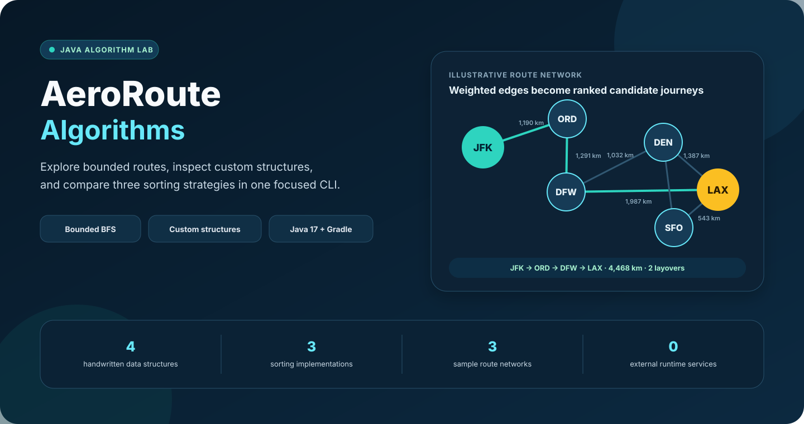
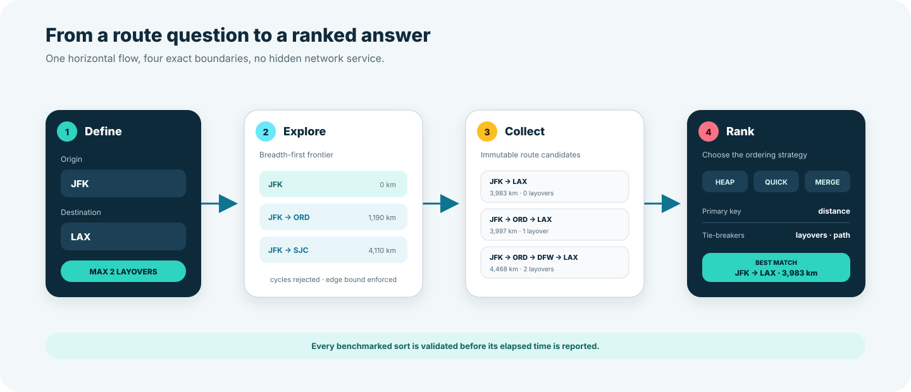
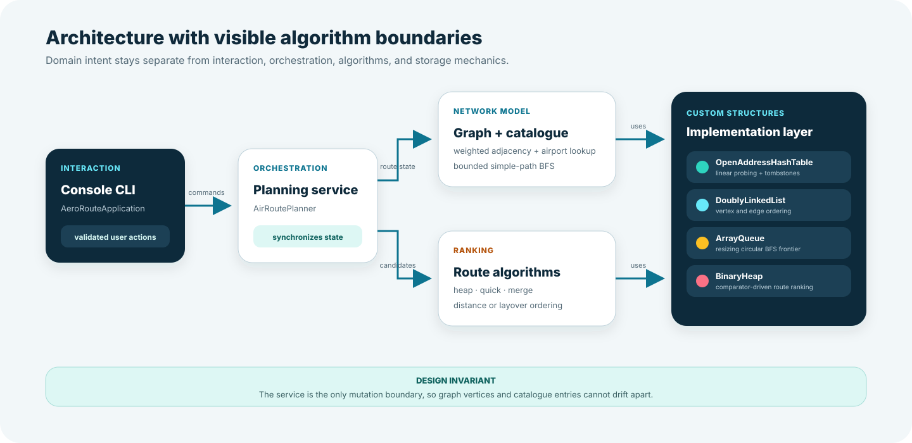

<p align="center">
  
</p>

<p align="center">
  <a href="https://github.com/Himath2002/aeroroute-algorithms/actions/workflows/ci.yml"></a>
  
  
  <a href="LICENSE"></a>
</p>

# AeroRoute Algorithms

AeroRoute Algorithms is an interactive Java route-planning lab built around handwritten data structures and algorithms. It models airports as a weighted, undirected graph; discovers simple routes within a layover limit; and ranks the resulting candidates with heap, quick, or merge sort.

The project is deliberately self-contained: no API key, database, network request, or framework hides the underlying mechanics.

## At a glance

| Area | What is implemented |
| --- | --- |
| Network model | Weighted airport graph with deterministic list and matrix views |
| Route discovery | Breadth-first enumeration of simple paths within a maximum layover count |
| Custom structures | Open-address hash table, doubly linked list, circular array queue, binary heap |
| Route ranking | Heap sort, median-of-three quick sort, and merge sort |
| Interaction | Validated terminal workflow with three reproducible sample networks |
| Verification | Focused JUnit tests, strict compiler warnings, enforced coverage floors, and GitHub Actions CI |

## What you can explore

- Add or remove airports while keeping the graph and airport catalogue synchronized.
- Create and remove weighted, bidirectional routes.
- Inspect the network as an adjacency list or distance matrix.
- Discover every simple route that fits a selected layover limit.
- Rank candidate routes by total distance or number of layovers.
- Compare three sorting implementations across ascending, descending, random, and nearly sorted input.
- Inspect load factor, airport count, and connection count directly from the CLI.

## Route discovery

<p align="center">
  
</p>

For a query such as `JFK` to `LAX` with at most two layovers, the graph explores path states in breadth-first order. A path is never allowed to revisit an airport, and expansion stops once the edge limit is reached. Each match becomes an immutable `Route` value containing its ordered stops and accumulated distance.

The ranking comparator uses deterministic tie-breakers:

1. Selected key: distance or layovers.
2. The alternative numeric key.
3. Lexicographic path text.

## Run locally

### Prerequisite

- JDK 17 or later. The Gradle wrapper is included; a system Gradle installation is not required.

Confirm Java is available:

```bash
java -version
```

### Launch a sample network

macOS or Linux:

```bash
./gradlew run --args="1"
```

Windows:

```powershell
gradlew.bat run --args="1"
```

Choose sample network `1`, `2`, or `3`. Omitting the argument loads network `1`.

### Example result

The following output was reproduced from sample network `1`:

```text
3 candidate routes:
 1. JFK -> LAX | 3983 km | 0 layovers
 2. JFK -> ORD -> LAX | 3997 km | 1 layover
 3. JFK -> ORD -> DFW -> LAX | 4468 km | 2 layovers
Best match: JFK -> LAX | 3983 km | 0 layovers
```

## Architecture

<p align="center">
  
</p>

The package boundaries reflect responsibilities rather than file type:

| Package | Responsibility |
| --- | --- |
| `app` | Terminal interaction and input validation |
| `service` | Single mutation boundary that synchronizes graph and catalogue state |
| `domain` | Validated, immutable `Airport` and `Route` values |
| `graph` | Weighted adjacency model and bounded breadth-first route discovery |
| `algorithm` | Route comparators and three sorting implementations |
| `structure` | Generic data structures used by the graph and ranking layers |
| `sample` | Reproducible demonstration networks |
| `benchmark` | Deterministic input generation and correctness-checked timing |

## Custom data structures

| Structure | Design | Key operations |
| --- | --- | --- |
| `OpenAddressHashTable<V>` | String keys, linear probing, tombstones, prime-sized growth | Average `O(1)` get/put/remove; worst-case `O(n)` |
| `DoublyLinkedList<T>` | Generic bidirectional nodes and iterable traversal | `O(1)` end insertion/removal; `O(n)` search |
| `ArrayQueue<T>` | Dynamically resized circular buffer | Amortized `O(1)` offer and poll |
| `BinaryHeap<T>` | Comparator-driven min-heap | `O(log n)` offer/poll and `O(1)` peek |

These implementations are intentionally visible. Java collections are used only at clean public boundaries—for example, immutable route results—not as substitutes for the structures being demonstrated.

## Sorting strategies

| Algorithm | Expected time | Extra space | Implementation detail |
| --- | --- | --- | --- |
| Heap | `O(n log n)` | `O(n)` in this extraction-based implementation | Uses the custom comparator-driven binary heap |
| Quick | Average `O(n log n)`, worst `O(n²)` | `O(log n)` stack target | Median-of-three pivoting and smaller-partition recursion limit stack depth |
| Merge | `O(n log n)` | `O(n)` | Stable merge operation with one reusable buffer |

Run the benchmark locally:

```bash
./gradlew benchmark
```

Every returned ordering is validated before its elapsed time is printed. Timings are exploratory rather than scientific; JVM warm-up, hardware, and background activity affect the result. See [benchmark methodology](docs/benchmarking.md) for the input model and a reference run.

## Inputs and outputs

| Input | Validation | Output |
| --- | --- | --- |
| Airport code | Exactly three letters; normalized to uppercase | Catalogue and graph entry |
| Airport name | Non-blank text | Immutable `Airport` value |
| Route distance | Positive integer in kilometres | Weighted undirected connection |
| Origin and destination | Existing, distinct airport codes | Candidate simple paths |
| Maximum layovers | Non-negative integer | Search expansion boundary |
| Ranking key | Distance or layovers | Deterministically ordered routes |
| Benchmark size/order | Built-in deterministic scenarios | Validated elapsed-time rows |

## Verification

Run the same quality gate used by CI:

```bash
./gradlew clean build
```

Useful focused commands:

```bash
# Compile with all Java warnings treated as errors
./gradlew classes

# Run the 12 focused tests
./gradlew test

# Open the generated coverage report
open build/reports/jacoco/test/html/index.html
```

The test suite covers route discovery boundaries, connection and airport removal, graph views, service synchronization, hash-table resizing and tombstones, queue wraparound, linked-list end integrity, heap ordering, deterministic benchmark data, and agreement among all three sorts.

The build also enforces repository-wide minimums of 60% line coverage and 50% branch coverage. These are guardrails against untested regression, not a substitute for behavior-focused assertions.

## Project structure

```text
aeroroute-algorithms/
├── .github/
│   ├── workflows/ci.yml              # Compile, test, and coverage workflow
│   └── dependabot.yml                 # Monthly dependency maintenance
├── docs/
│   ├── architecture.svg              # Package and dependency boundaries
│   ├── benchmarking.md               # Methodology and reference output
│   ├── hero.svg                      # Repository overview visual
│   └── route-discovery.svg           # Query-to-ranking walkthrough
├── src/
│   ├── main/java/io/github/himath2002/aeroroute/
│   │   ├── algorithm/                # Heap, quick, and merge sorting
│   │   ├── app/                      # Console workflow and validation
│   │   ├── benchmark/                # Deterministic performance exploration
│   │   ├── domain/                   # Airport and Route values
│   │   ├── graph/                    # Weighted graph and bounded BFS
│   │   ├── sample/                   # Three demonstration networks
│   │   ├── service/                  # Graph/catalogue coordination
│   │   └── structure/                # Four custom data structures
│   └── test/java/io/github/himath2002/aeroroute/
│       └── *Test.java                # Focused behavior and invariant checks
├── build.gradle.kts
├── settings.gradle.kts
└── gradlew
```

## Engineering decisions

- **One mutation boundary:** `AirRoutePlanner` updates the graph and catalogue together, avoiding the synchronization drift possible with two independent menus.
- **Immutable results:** public airport and route values validate themselves and cannot be changed after construction.
- **Cycle-safe path discovery:** each queued path records its own stops, so a candidate cannot revisit an airport.
- **Deterministic presentation:** graph views, catalogue rows, and route ties use explicit ordering, making tests and reviewer output repeatable.
- **Truthful benchmarking:** the benchmark verifies correctness and clearly labels elapsed times as machine-dependent observations.
- **No hidden infrastructure:** all sample data is local and in memory; running the project never contacts a flight service.

## Scope and limitations

- The bundled airport networks are illustrative datasets for algorithm exploration, not live schedules or booking data.
- Connections are undirected and store one integer distance; departure time, fare, carrier, and availability are intentionally outside scope.
- Enumerating all simple routes can grow exponentially as network density and layover limits increase. The layover bound is therefore both a user requirement and a computational guardrail.
- The benchmark is a transparent educational harness, not a replacement for JMH or a statistically controlled performance study.

## License

Released under the [MIT License](LICENSE).

Designed and implemented by [Himath Ahangama](https://github.com/Himath2002).
